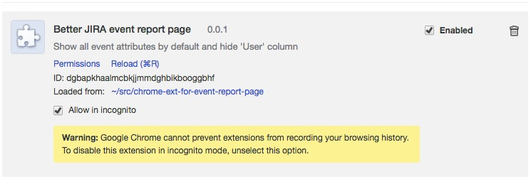
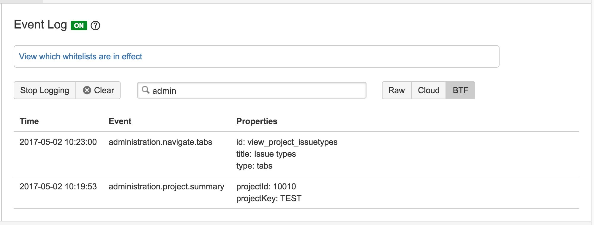

# Better JIRA event report page #

It's a tiny chrome extension designed to help you be more productive when checking events and their attributes, especially.

## Installation ##

Drag&drop the folder into `chrome://extensions`.

## New look&feel of event report page

- no `User` column
- no `Show more` trigger, all attributes are always visible
 

